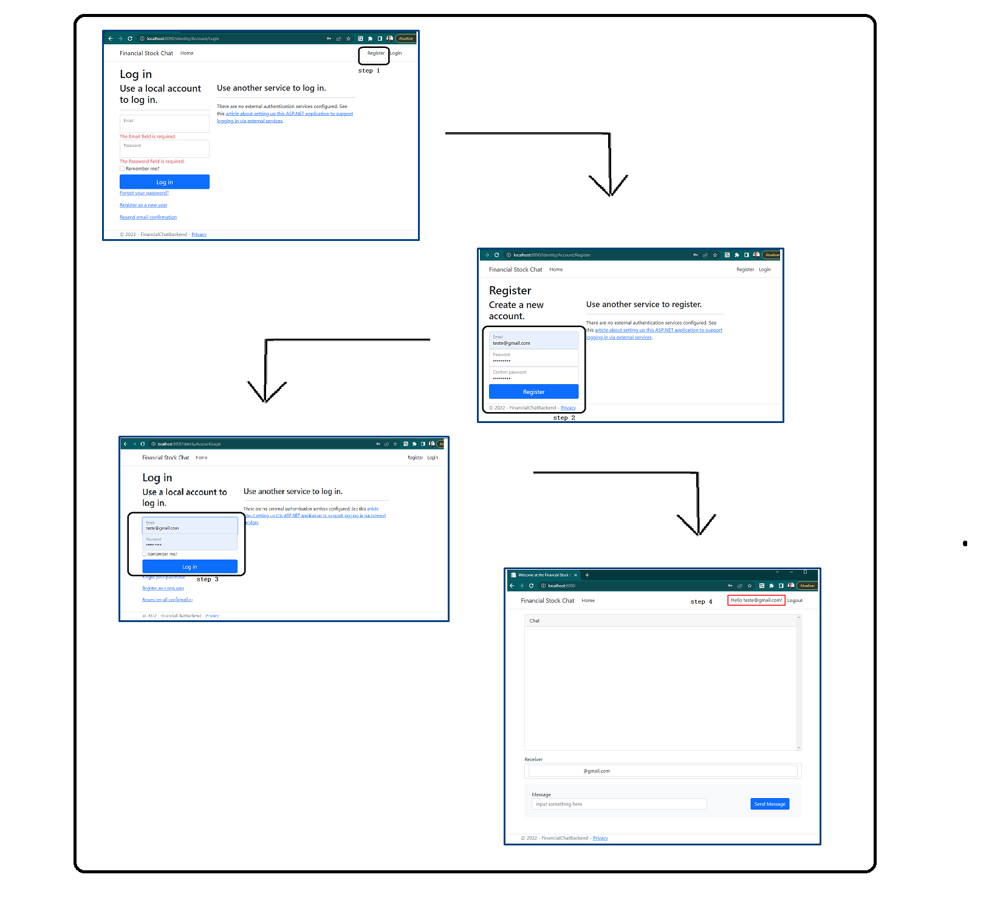

# Project Financial Stock Chat

<!---Esses são exemplos. Veja https://shields.io para outras pessoas ou para personalizar este conjunto de escudos. Você pode querer incluir dependências, status do projeto e informações de licença aqui--->


## Architecture drawing


> This Project allow registered users to log in and talk with other users in a chatroom.

## Building with:


[](https://developer.mozilla.org/pt-BR/docs/Web/HTML)
[](https://developer.mozilla.org/pt-BR/docs/Web/CSS)
[](https://developer.mozilla.org/pt-BR/docs/Web/JavaScript)


## Features

> The project is still in development and the next updates will focus on the following tasks:

- [x] Apply SignalR Configuration at Backend
- [x] Apply SignalR Configuration at Frontend
- [x] Apply MassTransit Configuration at Backend to Handle with Queues 
- [x] Apply InMemory Configuratino at Backend to Handle with the historical chat message
- [x] Apply Docker Configuration at Web Project 
- [x] Apply Docker Configuration at Consumer Project
- [x] Integrate with Stooq's API for get the information about the stock_code 
- [x] Implement function for send message by Chat Bot 
- [x] Implement Unit Test


## Project Layers

- Web
    - Presentation layer
        - Here will be the access points to the functionalities of your services, their controllers, Frontend, etc.
- Application
    - This layer integrates with your services layer, think of it as an orchestrator.
    - If a certain functionality needs to search for something in the bank, it will call the Infrastructure functionality, repositories for example, to return information from the bank
    - If a certain functionality needs to fetch something in a third-party api, it will call the infrastructure functionality, some sub-layer of integration to return this information
    - If the information needs to be validated by the domain, the Domain Layers will be activated for such validation.
- Domain
    - Layer that encapsulates the entities and Interfaces of your project.
- CrossCuting
    - A separate layer that does not obey the layer hierarchy. As the name implies, this layer crosses the entire hierarchy. Contains features that can be used in any part of the code, such as, for example, CPF/CNPJ validation, external API consumption and use of some security.
- Infrastructure
    - The infrastructure layer serves to support non-domain responsibilities
- IoC
    - This layer is where the management of your project's dependency injections will be centralized.
    - Used when you want to reduce the coupling between different components/modules of a system
- Test
    - This layer has the responsibility to handle the unit testing of your entire project
    - It is in this project that the Tests and Mocks frameworks will be configured.


## 💻 Pré-requirment

Before starting, make sure you've met the following requirements:
<!---Estes são apenas requisitos de exemplo. Adicionar, duplicar ou remover conforme necessário--->
* You need to have installed on your machine.`<docker>` and `<docker-compose>`


## 🚀 Deploying / Publishing FinancialChatBackend

To run FinancialChatBackend, follow these steps:

Go to the project root folder and execute the command below:
```
docker-compose up
```


> you will see something like this


## ☕ Using FinancialChatBackend

To use FinancialChatBackend, follow these steps:

```
step 0 - input this address: http:localhost:8090 in Browser
step 1 - click in the register button
step 2 - register a new user
step 3 - click in the login button
step 4 - you will redirect to logged area and you'll see the chat
```

> you will see something like this



## ☕ Using RabbitMQ

To use RabbitMQ, follow these steps:

```
step 0 - input this address: http:localhost:15672 in Browser
step 1 - enter with credentials: User: guest | Password: guest

```

> you will see something like this


<!-- [⬆ Voltar ao topo](#FinancialChatBackend)<br> -->